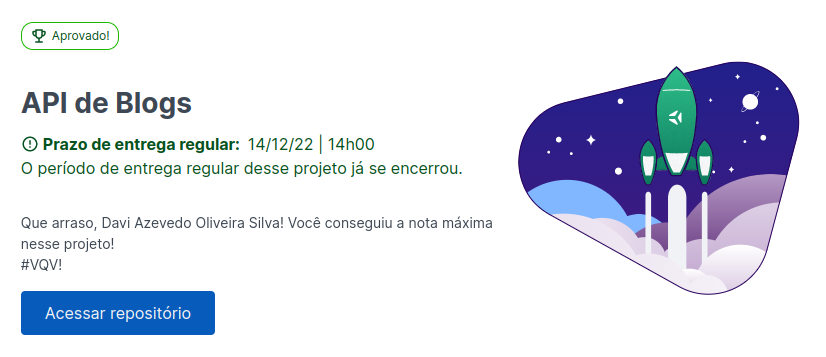

# Blogs API

[Leia em Português](#português-) | [Read in English](#english-)

---

## Português 🇧🇷

### Sobre

Blogs API é um projeto desenvolvido durante o módulo de backend no curso da Trybe. O objetivo é criar uma API para um blog usando o ORM Sequelize.

Os códigos desenvolvidos por mim podem ser encontrados nas pastas `src`.

### Ferramentas usadas

- Docker
- Express
- Node
- Joi
- Sequelize
- MySQL

### Orientações

<strong>🐋 Rodando no Docker vs Localmente</strong>
 

#### Com Docker 

- Clone o repositório com o comando `git@github.com:daviazev/blogs-api.git`
- Entre na pasta com o comando `cd blogs-api`
> Tendo o Docker e o Docker Compose instalados, rode usando o comando `docker-compose up -d`
- Esses serviços irão inicializar um container chamado `blogs_api` e outro chamado `blogs_api_db`.
- A partir daqui você pode rodar o container via CLI ou abri-lo no VS Code.
> Use o comando `docker exec -it blogs_api bash`
- Ele te dará acesso ao terminal interativo do container criado pelo compose, que está rodando em segundo plano.
> Instale as dependências [Caso existam] com `npm install`
> Execute a aplicação com `npm start`

#### Sem Docker

- Clone o repositório com o comando `git@github.com:daviazev/blogs-api.git`
- Entre na pasta com o comando `cd blogs-api`
- Instale as dependências [Caso existam] com `npm install`

1. Para rodar o projeto desta forma, obrigatoriamente você deve ter o `node` na versão `16` instalado em seu computador.

---

## English 🇺🇸

### About

Blogs API is a project developed during the backend module of the Trybe course. The goal is to create an API for a blog using the Sequelize ORM.

The code developed by me can be found in the `src` folder.

### Tools Used

- Docker
- Express
- Node
- Joi
- Sequelize
- MySQL

### Instructions

<strong>🐋 Running on Docker vs Locally</strong>
 

#### With Docker 

- Clone the repository using the command `git@github.com:daviazev/blogs-api.git`
- Navigate to the folder using the command `cd blogs-api`
> With Docker and Docker Compose installed, run it using the command `docker-compose up -d`
- These services will start a container named `blogs_api` and another named `blogs_api_db`.
- From here, you can run the container via CLI or open it in VS Code.
> Use the command `docker exec -it blogs_api bash`
- It will give you access to the interactive terminal of the container created by the compose, which is running in the background.
> Install the dependencies [if any] using `npm install`
> Run the application with `npm start`

#### Without Docker

- Clone the repository using the command `git@github.com:daviazev/blogs-api.git`
- Navigate to the folder using the command `cd blogs-api`
- Install the dependencies [if any] using `npm install`

1. To run the project this way, you must have `node` version `16` installed on your computer.

